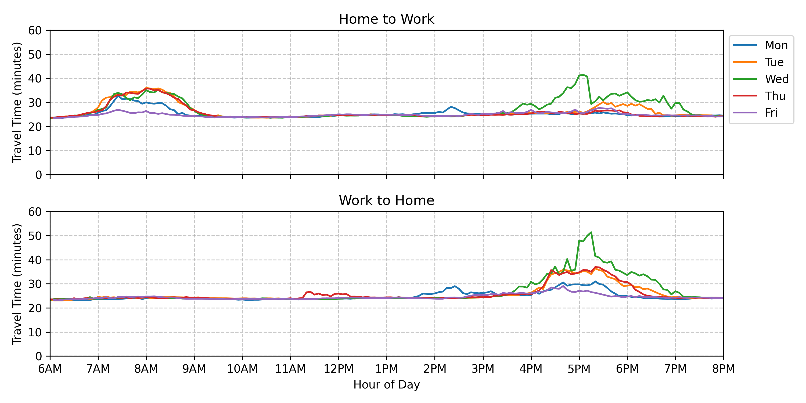
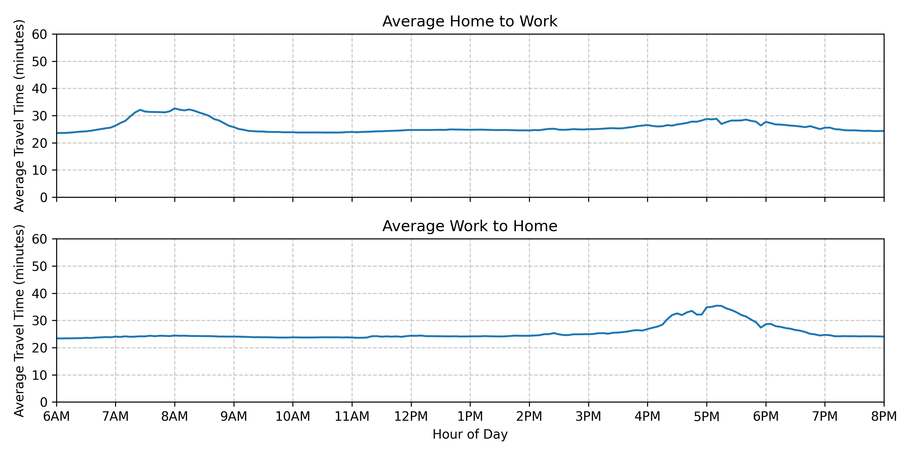

# Traffic

A traffic tracker.

I want to know how long it will take me to drive to work. 

## DEV LOG

### 2024-10-08 (Data!)

So the first run was a success!
I used my personal computer so the compute costs were zero.
Looking at the Google Cloud Dashboard it looks like I racked up 2,154 API calls which amounted to $21.55.
Well within the monthly credit.

Here are the fruits of my labor!

#### Daily Traffic 


#### Average Traffic


I guess leaving at 7AM is a good call, and 4PM beats most of the afternoon traffic. 

### 2024-09-29 (First Run)

Well decided to just run the program from my personal computer as I won't be using it much this week anyway. I plan to leave it up and running all week and hopefully I can get some interesting data. 

### 2024-09-24 (MVP 1):

I have setup the database and added some comments to the code. I think we are in a good place to experiment
with running on an EC2 instance. 

There are two costs to consider:
1. Google Maps API
2. EC2 Instance

#### Google Maps API
I am using the [Distance Matrix API](https://developers.google.com/maps/documentation/distance-matrix/usage-and-billing) which costs 0.005 USD per SKU. I think in my case I am making two calls to the API every 5 minutes between the hours of 6am and 8pm. Lets run the numbers

```
2 * 0.005 (Cost/API) * 12 (API/Hour) * 13 (Hours/Day) * 5 (Days) = $7.80 
```

The Google Maps Platform offers a $200 [monthly credit](https://developers.google.com/maps/billing-and-pricing/billing#monthly-credit) so I should be in the clear. 

#### AWS EC2
The `t2.nano` instance priced at 0.0058 per hour to run. A naive approach would be to spin up an EC2 instance and run the program all week. 

```
0.0058 (Cost/Hour) * 24 (Hour/Day) * 5 (Days) = $ 0.7
```

Pretty cheap! It's a bit wastful running the instance all night, but scheduling seems like more of a headache than its worth for now. I can revisit the issue if I scale. 

### 2024-09-23 (Inital setup):

Aaahhh that fresh repository smell. Let's see how long it takes to muck things up.

I have never used [Poetry](https://python-poetry.org/) before, so lets give that a shot!
```bash
curl -sSL https://install.python-poetry.org | python3 -
```

As this is not a package, I need to set `package-mode = false` in the `pyproject.toml` file.
```bash
[tool.poetry]
package-mode = false
```

To install the dependencies only, such as when deploying this application, run the install command with the --no-root flag:
```bash
poetry install --no-root
```

I have installed the cursor editor and I experimenting with an AI centric workflow. We will see how this goes. 

I have the basic structure of the program outlined. Next time, I am now going to try to set up the database. 
